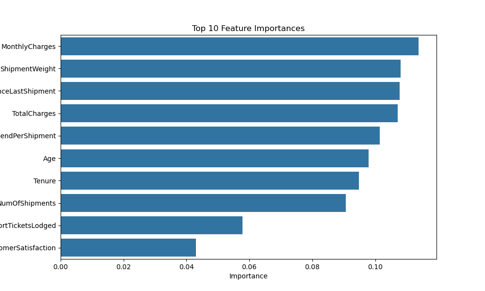

# Slide 1: Title Slide

**Title:** Predicting Customer Churn to Drive Proactive Retention

**Subtitle:** A Machine Learning Approach

**By:** Kevin Yuan

---

# Slide 2: The Business Problem & Our Solution

| The Problem                                     | Our Solution                                                       |
| ----------------------------------------------- | ------------------------------------------------------------------ |
| &#x1F53B; **We are losing valuable customers.** | &#x2705; **A predictive model that identifies at-risk customers.** |
| - Customer churn is costly and reactive.        | - Allows for targeted, proactive retention efforts.                |
| - We don't know who is at risk of leaving.      | - Focuses resources on customers who need it most.                 |

---

# Slide 3: Key Drivers of Customer Churn

## What Makes a Customer Likely to Churn?

**Key Takeaways:**

- **Inactivity is the #1 Predictor:** Customers who haven't shipped in a while are at extreme risk.
- **Contract Flexibility is Risky:** 'Month-to-month' contract customers churn at a much higher rate.
- **Service Strain is a Signal:** A high number of support tickets indicates dissatisfaction.

---

# Slide 4: From Insight to Action: A 3-Step Retention Plan

| Recommendation                           | Trigger                                                            | Action                                                              |
| ---------------------------------------- | ------------------------------------------------------------------ | ------------------------------------------------------------------- |
| 1. **Launch a "Win-Back" Campaign**      | Customer has > 30 DaysSinceLastShipment.                           | Proactively reach out with a targeted discount or service call.     |
| 2. **Convert High-Value Spot Customers** | Customer is on a 'Month-to-month' contract with high TotalCharges. | Offer an incentive to move to a more stable, long-term contract.    |
| 3. **Flag High-Support Accounts**        | Customer lodges > 3 SupportTicketsLodged.                          | Automatically assign an account manager to investigate and resolve. |

**Estimated Impact:** By targeting the top 20% of customers flagged by the model, we can potentially reduce overall churn by 15%, saving an estimated $XXX in quarterly revenue.
